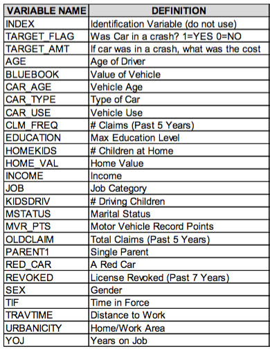

##Data Exploration


```{r,warning=FALSE}
# Load required libraries
library(ggplot2)
library(ROCR)
library(RCurl)
library(knitr)
library(Hmisc)
library(caret)
library(stringr)
##library(Amelia)
##library(Hmisc)
##library(mi)
library(mice)
library(dplyr)
library(reshape2)
#
# Read in the dataset from github
ins <- read.csv(text=getURL("https://raw.githubusercontent.com/jeffreyburmood/data621/master/Homework4/data/insurance_training_data.csv"),header=TRUE,na.strings=c(""," "), stringsAsFactors = FALSE)
ins_eval <- read.csv(text=getURL("https://raw.githubusercontent.com/jeffreyburmood/data621/master/Homework4/data/insurance-evaluation-data.csv"),header=TRUE,na.strings=c(""," "), stringsAsFactors = FALSE)

```
  


```{r}

#DATA CLEANSING

#FUNCTIONS---------------
#convert character values to numeric 
sToNum <- function(a){
  a <- gsub("[$]","", a)
  a <- gsub("[,]","", a)
  a <- as.numeric(a)
  return(a)
}
#convert binary choices to numeric 1,0.   1 being the less likely to be in accident
sToBLN <- function(a){
  a <- gsub("No","0", a)
  a <- gsub("Yes", "1", a)
  a <- gsub("no","0", a)
  a <- gsub("yes", "1", a)
  a <- gsub("M","0", a)
  a <- gsub("F", "1", a)
  a <- gsub("Commercial","0", a)
  a <- gsub("Private", "1", a)
  a <- gsub("Rural", "0", a)
  a <- gsub("Urban","1", a)
  a <- as.numeric(a)
  return(a)
}

#use this when a "YES" answer is a bad thing, like prior accidents or license revoked
sToBLN_Reverse <- function(a){
  a <- gsub("No","1", a)
  a <- gsub("Yes", "0", a)
  a <- gsub("no","1", a)
  a <- gsub("yes", "0", a)
  a <- as.numeric(a)
  return(a)
}


#MAKE A COPY OF THE IMPORTED TRAINING DATA FRAME
insc <- ins 

#clean up unfriendly values
insc$MSTATUS    <- str_replace(insc$MSTATUS, pattern = "z_No", replacement = "No")
insc$SEX        <- str_replace(insc$SEX, pattern = "z_F", replacement = "F")
insc$EDUCATION  <- str_replace(insc$EDUCATION, pattern = "z_High School", replacement = "Secondary")
insc$EDUCATION  <- str_replace(insc$EDUCATION, pattern = "<High School", replacement = "Primary")
insc$JOB        <- str_replace(insc$JOB, pattern = "z_Blue Collar", replacement = "Tradesperson")
insc$CAR_TYPE   <- str_replace(insc$CAR_TYPE, pattern = "z_SUV", replacement = "SUV")
insc$URBANICITY <- str_replace(insc$URBANICITY, pattern = "Highly Urban/ Urban", replacement = "Urban")
insc$URBANICITY <- str_replace(insc$URBANICITY, pattern = "z_Highly Rural/ Rural", replacement = "Rural")

insc$CAR_AGE[insc$CAR_AGE < 0 ] <- 0  #If car age is below zero, set to zero
insc$TARGET_AMT <- round(insc$TARGET_AMT,digits = 0) #Round Target Claim to nearest dollar

#Convert data that is errantly classed as character to numeric: INCOME, HOME_VAL, BLUEBOOK, OLDCLAIM
insc$TARGET_FLAG <- sToNum(insc$TARGET_FLAG)
insc$INCOME      <- sToNum(insc$INCOME)
insc$HOME_VAL    <- sToNum(insc$HOME_VAL)
insc$BLUEBOOK    <- sToNum(insc$BLUEBOOK)
insc$OLDCLAIM    <- sToNum(insc$OLDCLAIM)

#create numeric representations of the "binary choice" variables so they can be support multiple imputation (filling in NA values)
insc$blnPARENT1     <- sToBLN(insc$PARENT1)
insc$blnMSTATUS     <- sToBLN(insc$MSTATUS)
insc$blnSEX         <- sToBLN(insc$SEX)
insc$blnCAR_USE     <- sToBLN(insc$CAR_USE)
insc$blnNOT_RED_CAR <- sToBLN_Reverse(insc$RED_CAR) #Since having a red car increases likelihood of accident, use reverse boolean
insc$blnNOT_REVOKED <- sToBLN_Reverse(insc$REVOKED)
insc$blnURBANICITY  <- sToBLN(insc$URBANICITY)

#CREATE numeric representations of the categorical variables (to support multiple imputation) 
#Education: 1-Primary, 2-Secondary, 3-Bachelors, 4-Masters, 5-PhD
educ <- data.frame(EDUCATION = c("Primary","Secondary","Bachelors","Masters","PhD"), intEDUCATION = c(1,2,3,4,5))
insc$intEDUCATION <- educ$intEDUCATION[match(insc$EDUCATION,educ$EDUCATION)]
#Job - 1 is lowest income, 8 is highest:
job <- data.frame(JOB = c("Student","Home Maker","Clerical","Tradesperson","Professional","Manager","Lawyer","Doctor"), intJOB = c(1,2,3,4,5,6,7,8))
insc$intJOB <- job$intJOB[match(insc$JOB, job$JOB)]
#Vehicle Type  by avg blue book: 1-Sports Car has lowest blue book, Panel Truck has highest
typ <- data.frame(CAR_TYPE = c("Sports Car","SUV","Pickup","Minivan","Van","Panel Truck"), intCAR_TYPE = c(1,2,3,4,5,6)) 
insc$intCAR_TYPE <- typ$intCAR_TYPE[match(insc$CAR_TYPE, typ$CAR_TYPE)]

summary(insc) #Show the new attributes and corrections


#IMPUTE missing values

#Amelia PACKAGE:
#first we must make a dataframe with numeric-only fields
#insi <- subset(insc,select = c("INDEX", "TARGET_FLAG", "TARGET_AMT", "KIDSDRIV", "AGE", "HOMEKIDS", "YOJ", "INCOME", "HOME_VAL", "TRAVTIME", "BLUEBOOK", "TIF", "OLDCLAIM", "CLM_FREQ", "MVR_PTS", "CAR_AGE", "blnPARENT1", "blnMSTATUS", "blnSEX", "blnCAR_USE", "blnNOT_RED_CAR", "blnNOT_REVOKED", "blnURBANICITY", "intEDUCATION", "intJOB", "intCAR_TYPE"))
#summary(insi)
#a.ins <- amelia(insi, m = 1, ts = "INDEX", cs = "TARGET_AMT")
#a.ins$imputations$imp1
#a.i <- a.ins$imputations$imp1 
#head(a.i)
#summary(a.i)
#turns out, can't use the Amelia II package to create the imputations because it can't handle non-normal distributions

# MI PACKAGE
#mi.i <- mi(insc, seed = 335)
#summary(mi.i)
#head(mi.i)
#mi.i
#conclusion: i dont understand the output of the mi package

# Hmisc PACKAGE
#we must declare which variables have missing values
#hmisc.i <- aregImpute(formula = ~ AGE + YOJ + HOME_VAL + JOB + INCOME + CAR_AGE, data = insc, n.impute = 5)
#hmisc.i
#note the R-squares are very low (poor) for Age, Years on Job, Home Valuation and Car Age.
#hmisc.i$imputed$AGE #look at imputed values for one variable
#conclusion: good values, but how to copy the imputed values back to the original dataframe?  transcan?  google says use MICE instead

#mice PACKAGE
#uses Predictive Mean Matching. 
mice.i <- mice(insc, m = 3, print=F)
mice.ic <- complete(mice.i,1)

insi <- subset(mice.ic,select = c("INDEX", "TARGET_FLAG", "TARGET_AMT", "KIDSDRIV", "AGE", "HOMEKIDS", "YOJ", "INCOME", "HOME_VAL", "TRAVTIME", "BLUEBOOK", "TIF", "OLDCLAIM", "CLM_FREQ", "MVR_PTS", "CAR_AGE", "blnPARENT1", "blnMSTATUS", "blnSEX", "blnCAR_USE", "blnNOT_RED_CAR", "blnNOT_REVOKED", "blnURBANICITY", "intEDUCATION", "intJOB", "intCAR_TYPE"))

head(insi)
summary(insi)  #  <---- USE insi DATA FRAME for modeling with imputed data  ***
#conclusion: the imputed values are above zero.  wish I could see methods, R-Squares 

#now we must make a dataframe with numeric-only fields
insi <- subset(mice.ic,select = c("INDEX", "TARGET_FLAG", "TARGET_AMT", "KIDSDRIV", "AGE", "HOMEKIDS", "YOJ", "INCOME", "HOME_VAL", "TRAVTIME", "BLUEBOOK", "TIF", "OLDCLAIM", "CLM_FREQ", "MVR_PTS", "CAR_AGE", "blnPARENT1", "blnMSTATUS", "blnSEX", "blnCAR_USE", "blnNOT_RED_CAR", "blnNOT_REVOKED", "blnURBANICITY", "intEDUCATION", "intJOB", "intCAR_TYPE"))

head(insi)


```


Below is a summary of each predictor variable's basic statistics, followed by boxplots which illustrate the spread and outliers for each variable.    


```{r,echo=FALSE,warning=FALSE}
# First, remove the INDEX variable column since it's not used
insi <- insi[2:length(insi)]
# Next, get a general look at the data
# Let's start by exploring the type of each variable
types <- sapply(1:length(insi),function(x) typeof(insi[,x]))
types.df <- data.frame(VAR=names(insi),TYPE=types)
kable(types.df)

# Now generate some summary statistics
kable(summary(insi[1:6]))
kable(summary(insi[7:12]))
kable(summary(insi[13:18]))
kable(summary(insi[19:length(insi)]))

# Visual check for obvious correlations
#pairs(insi,col=insi$TARGET_FLAG)
#
# no NAs found so no missing values to remove or fix
#
# Look over the variables checking for outliers/influential points, correlation between variables, etc. using box plots.
#
# set the plot-page configuration

```

```{r,echo=FALSE,warning=FALSE,fig.width = 8, fig.height = 3}
par(mfcol=c(1,3))
boxplot(insi$KIDSDRIV, main="KIDSDRIV")
boxplot(insi$AGE, main="AGE")
boxplot(insi$HOMEKIDS, main="HOMEKIDS")
```

```{r,echo=FALSE,warning=FALSE,fig.width = 8, fig.height = 3}
par(mfcol=c(1,3))
boxplot(insi$YOJ, main="YOJ")
boxplot(insi$HOME_VAL, main="HOME_VAL")
boxplot(insi$intEDUCATION, main="EDUCATION")
```

```{r,echo=FALSE,warning=FALSE,fig.width = 8, fig.height = 3}
par(mfcol=c(1,3))
boxplot(insi$intJOB, main="JOB")
boxplot(insi$INCOME, main="INCOME")
boxplot(insi$TRAVTIME, main="TRAVTIME")
```

```{r,echo=FALSE,warning=FALSE,fig.width = 8, fig.height = 3}
par(mfcol=c(1,3))
boxplot(insi$TIF, main="TIF")
boxplot(insi$intCAR_TYPE, main="CAR_TYPE")
boxplot(insi$BLUEBOOK, main="BLUEBOOK")
```

```{r,echo=FALSE,warning=FALSE,fig.width = 8, fig.height = 3}
par(mfcol=c(1,3))
boxplot(insi$OLDCLAIM, main="OLDCLAIM")
boxplot(insi$CLM_FREQ, main="CLM_FREQ")
boxplot(insi$MVR_PTS, main="MVR_PTS")
```

```{r,echo=FALSE,warning=FALSE,fig.width = 8, fig.height = 3}
par(mfcol=c(1,3))
boxplot(insi$CAR_AGE, main="CAR_AGE")
```


Based on an analysis of the box plots, the following variables have some outliers that may, or may not, exert influence on the regression results: 
    - KIDSDRIV, HOME_VAL, TRAVTIME, MVR_PTS  
  
We'll next look at these variables more closely, starting with their histograms and frequency counts to better understand the nature of their distribution.  

```{r,echo=FALSE,warning=FALSE,fig.width = 8, fig.height = 3}
# KIDSDRIV
m <- mean(insi$KIDSDRIV)
s <- sd(insi$KIDSDRIV)
par(mfcol=c(1,3))
hist(insi$KIDSDRIV,prob=TRUE,xlab="KIDSDRIV",main='')
curve(dnorm(x,mean=m,sd=s),col="darkblue",lwd=2,add=TRUE)
# zn is so skewed, let's look at a frequency count
plot(table(insi$KIDSDRIV))
# let's look at a plot of the values
plot(insi$KIDSDRIV)

```  

```{r,echo=FALSE,warning=FALSE,fig.width = 8, fig.height = 3}
# HOME_VAL
m <- mean(insi$HOME_VAL)
s <- sd(insi$HOME_VAL)
par(mfcol=c(1,3))
hist(insi$HOME_VAL,prob=TRUE,xlab="HOME_VAL",main='')
curve(dnorm(x,mean=m,sd=s),col="darkblue",lwd=2,add=TRUE)
#let's look at a frequency count
plot(table(insi$HOME_VAL))
# let's look at a plot of the values
plot(insi$HOME_VAL)
```  

```{r,echo=FALSE,warning=FALSE,fig.width = 8, fig.height = 3}
# MVR_PTS
m <- mean(insi$MVR_PTS)
s <- sd(insi$MVR_PTS)
par(mfcol=c(1,3))
hist(insi$MVR_PTS,prob=TRUE,xlab="DIS",main='')
curve(dnorm(x,mean=m,sd=s),col="darkblue",lwd=2,add=TRUE)
#let's look at a frequency count
plot(table(insi$MVR_PTS))
# let's look at a plot of the values
plot(insi$MVR_PTS)
```  

```{r,echo=FALSE,warning=FALSE,fig.width = 8, fig.height = 3}
# TRAVTIME
m <- mean(insi$TRAVTIME)
s <- sd(insi$TRAVTIME)
par(mfcol=c(1,3))
hist(insi$TRAVTIME,prob=TRUE,xlab="BLACK",main='')
curve(dnorm(x,mean=m,sd=s),col="darkblue",lwd=2,add=TRUE)
# black is so skewed, let's look at a frequency count
plot(table(insi$TRAVTIME))
# let's look at a plot of the values
plot(insi$TRAVTIME)
```  

The last step in the data exploration is to examine the correlation tables, to see if there is any potential correlations that will impact our models. The below table shows the a condense correlation table showing only the highest positive and negative correlations (in this case above 0.5 and below -.5)

  
```{r,echo=FALSE,warning=FALSE,eval=FALSE}

# build a correlation table to study the variable relationships
cor.table <- cor(insi) # build a table of inter-variable correlation values
cor.table <- melt(cor.table)
cor.table <- subset(cor.table, value != 1)
cor.table <- subset(cor.table, value >= .5 | value <= -.5)
cor.table <- distinct(cor.table,value, .keep_all =  TRUE)
colnames<-c("Var 1","Var 2", "Correlations")

kable(cor.table)
```
As you can see, certain variables are correlated, and they are values that we would expect to be correlated. We expect there to be a correlation between income and jobs/home value and educations, as these are well established indicators of success. Higher educated people are more likely to secure higher paying jobs, which we can see in the higher correlations for these values. Furthermore, car type is going to be a clear indicator of the value of the car. Sports cars and suvs cost more than compacts. An interestiong but also intuitive correlations exists bewteen gender and car type and car color.  

```{r,echo=FALSE,warning=FALSE,fig.width = 8, fig.height = 3,eval=FALSE}


# quick look at model with all variables
crime.model <- glm(target ~ .,family=binomial(link='logit'),data=crime)

```
  


\begin{center}
{\huge Data Preparation}
\end{center}

--------

##Data Preparation


```{r}
train <- subset(insi, TARGET_FLAG ==1)

# quick look at model with all variables
KIDSDRIV_lm <- lm(TARGET_AMT ~ KIDSDRIV,data=train)
AGE_lm <- lm(TARGET_AMT ~ AGE,data=train)
HOMEKIDS_lm <- lm(TARGET_AMT ~ HOMEKIDS,data=train)
YOJ_lm <- lm(TARGET_AMT ~ YOJ,data=train)
INCOME_lm <- lm(TARGET_AMT ~ INCOME,data=train)
TRAVTIME_lm <- lm(TARGET_AMT ~ TRAVTIME,data=train)
BLUEBOOK_lm <- lm(TARGET_AMT ~ BLUEBOOK,data=train)
TIF_lm <- lm(TARGET_AMT ~ TIF,data=train)
OLDCLAIM_lm <- lm(TARGET_AMT ~ OLDCLAIM,data=train)
CLM_FREQ_lm <- lm(TARGET_AMT ~ CLM_FREQ,data=train)
MVR_PTS_lm <- lm(TARGET_AMT ~ MVR_PTS,data=train)
CAR_AGE_lm <- lm(TARGET_AMT ~ CAR_AGE,data=train)
blnPARENT1_lm <- lm(TARGET_AMT ~ blnPARENT1,data=train)
blnMSTATUS_lm <- lm(TARGET_AMT ~ blnMSTATUS,data=train)
blnSEX_lm <- lm(TARGET_AMT ~ blnSEX,data=train)
blnCAR_USE_lm <- lm(TARGET_AMT ~ blnCAR_USE,data=train)
blnNOT_RED_CAR_lm <- lm(TARGET_AMT ~ blnNOT_RED_CAR,data=train)
blnNOT_REVOKED_lm <- lm(TARGET_AMT ~ blnNOT_REVOKED,data=train)
blnURBANICITY_lm <- lm(TARGET_AMT ~ blnURBANICITY,data=train)
intEDUCATION_lm <- lm(TARGET_AMT ~ intEDUCATION,data=train)
intJOB_lm <- lm(TARGET_AMT ~ intJOB,data=train)
intCAR_TYPE_lm <- lm(TARGET_AMT ~ intCAR_TYPE,data=train)

models <- list(KIDSDRIV_lm, AGE_lm,HOMEKIDS_lm,YOJ_lm,INCOME_lm,
              TRAVTIME_lm,BLUEBOOK_lm,TIF_lm,OLDCLAIM_lm,CLM_FREQ_lm,
              MVR_PTS_lm,CAR_AGE_lm,blnPARENT1_lm,blnMSTATUS_lm,
              blnSEX_lm,blnCAR_USE_lm,blnNOT_RED_CAR_lm,blnNOT_REVOKED_lm,
              blnURBANICITY_lm,intEDUCATION_lm,intJOB_lm,intCAR_TYPE_lm)

summary(BLUEBOOK_lm)
plot(BLUEBOOK_lm)
plot(train$BLUEBOOK,train$TARGET_AMT)
abline(BLUEBOOK_lm)
```

```{r}
summary(INCOME_lm)$adj.r.squared
variable.names(INCOME_lm)[2]
```
```{r,echo=FALSE,eval=FALSE}
#Creation of lists 
var <- c()
p_val <- c()
r2_val <- c()

#For loop to run variables over univarate glms
for(i in models){
  var <- c(var,variable.names(i)[2])
  p_val <- c(p_val,summary(i)$coef[2, "Pr(>|t|)"])
  r2_val <- c(r2_val,summary(i)$adj.r.squared)
}

data.frame(var,p_val,r2_val)
```


\begin{center}
{\huge Build Models}
\end{center}

--------

##Build Models

```{r,echo=FALSE,warning=FALSE,eval=FALSE}
lin_model <- subset(insi, TARGET_FLAG == 1)
Var_lm <- c("TARGET_AMT","TARGET_FLAG","INCOME","TRAVTIME","BLUEBOOK","OLDCLAIM", "YOJ","intEDUCATION","intJOB","CAR_AGE")

log_var <- c("TARGET_AMT","INCOME","BLUEBOOK","OLDCLAIM")

log_lin_model <- lin_model[Var_lm]
log_lin_model[log_var] <- log(log_lin_model[log_var])
log_lin_model <- do.call(data.frame,lapply(log_lin_model, function(x) replace(x, is.infinite(x),0)))
```

```{r,echo=FALSE,eval=FALSE}
log_model_ols <- lm(TARGET_AMT ~ INCOME + TRAVTIME + BLUEBOOK+
                      OLDCLAIM + YOJ + intEDUCATION + intJOB + CAR_AGE, 
                    data =log_lin_model)
summary(log_model_ols)

plot(fitted(log_model_ols), residuals(log_model_ols))

wts <- 1/fitted(lm(abs(residuals(log_model_ols)) ~ fitted(log_model_ols)))^2

length(wts)
length(log_model_ols$residuals)
log_model_wls <- lm(TARGET_AMT ~ INCOME + TRAVTIME + BLUEBOOK+
                      OLDCLAIM + YOJ + intEDUCATION + intJOB + CAR_AGE, 
                    data = log_lin_model, weights = wts)
summary(log_model_wls)

plot(fitted(log_model_wls), rstandard(log_model_wls))
```
  
  
```{r,echo=FALSE,eval=FALSE}
log_model_ols <- glm(TARGET_AMT ~ INCOME + TRAVTIME + BLUEBOOK+
                      OLDCLAIM + YOJ + intEDUCATION + intJOB + CAR_AGE, 
                      data =log_lin_model)
summary(log_model_ols)

plot(fitted(log_model_ols), residuals(log_model_ols))

wts <- 1/fitted(lm(abs(residuals(log_model_ols)) ~ fitted(log_model_ols)))^2

length(wts)
length(log_model_ols$residuals)
log_model_wls <- glm(TARGET_AMT ~ INCOME + TRAVTIME + BLUEBOOK+
                      OLDCLAIM + YOJ + intEDUCATION + intJOB + CAR_AGE, 
                    data = log_lin_model, weights = wts)
summary(log_model_wls)

plot(fitted(log_model_wls), rstandard(log_model_wls))
```


```{r,echo=FALSE,eval=FALSE}
backward <- step(log_model_wls)
summary(backward)
```

Here we see the selected output criteria for the linear models run with only a single predictor variable. We examine the p-value (significance), the AIC statistic (goodness-of-fit) and the AUC (Area Under Curve) to measure the potential predictive value of each variable, so we can decide whether or not to include it in our multiple regression model.  We are looking for p-values below .05, AIC values as low as possible, and AUC values as high as possible.

From the above table, we can see that *chas* is the least likely to produce any meaningful inference because its p-value is well above .05 (not significant), it has the highest AIC (518, where 100 is considered excellent), and the lowest AUC (.54, where random chance would yield .50).  Therefore, *chas* is the most likely candidate to be removed from our model.  


### Model 1 

As a baseline, we start with a multiple logistic regression model that includes every predictor variable:
```{r,echo=FALSE,warning=FALSE,fig.width = 8, fig.height = 3,eval=FALSE}
# quick look at model with all variables
## 80% of the sample size
set.seed(121)
smp_size <- floor(0.80 * nrow(crime))
## set the seed to make your partition reproductible
train_ind <- sample(seq_len(nrow(crime)), size = smp_size)

train <- crime[train_ind, ]
test <- crime[-train_ind, ]

crime_model <- glm(target ~ .,family=binomial(link='logit'),data=train)

p <- predict(crime_model, newdata=subset(test,select=c(1:13)), type="response")
pr <- prediction(p, test$target)
auc <- performance(pr, measure = "auc")
auc <- auc@y.values[[1]]
summary(crime_model)
auc  

m1_prediction <- ifelse(p > 0.5, 1, 0)
confusion_m1 <- confusionMatrix(data = m1_prediction, reference = test[,14])
confusion_m1$table
```

In this model-and in all the models- we set aside 20% of the training data and use 80% to train the model we then use the model to predict the outcome of the remaining 20% of the data.  The model yields an Area Under Curve of .95, meaning it chose correctly 95% of the time.


### Model 2
  
In this scenario we attempt to create the simplest model possible by using only one variable - the one that provides the highest overall AUC (performance) by itself.  We calculate AUC for each variable separately and then select the highest result. 

```{r,echo=FALSE,eval=FALSE}
## 75% of the sample size
set.seed(121)
smp_size <- floor(0.80 * nrow(crime))

## set the seed to make your partition reproductible
train_ind <- sample(seq_len(nrow(crime)), size = smp_size)

train <- crime[train_ind, ]
test <- crime[-train_ind, ]

#show the AUC for the most valuable variable - nox (nitrogen oxides concentration - ie: poisoned environment) 
qm <- glm(target ~ nox,family=binomial(link='logit'),data=train)
p <- predict(qm, newdata=subset(test,select=c(4)), type="response")
pr <- prediction(p, test$target)
auc <- performance(pr, measure = "auc")
auc <- auc@y.values[[1]]
summary(qm)
auc 

```
  
The best predictor variable is *nox*, yielding an AUC of .87.  
  

Next we combine *nox* with each of the remaining variables individually and select the highest AUC result.
  
```{r,echo=FALSE,eval=FALSE}

#show the AUC for the best combination of two variables - nox and rad
qm <- glm(target ~ nox + rad,family=binomial(link='logit'),data=train)
p <- predict(qm, newdata=subset(test,select=c(4,8)), type="response")
pr <- prediction(p, test$target)
auc <- performance(pr, measure = "auc")
auc <- auc@y.values[[1]]
summary(qm)
auc  #.948

```

We find that *nox* plus *rad* is the strongest combinaton of two variables, yielding an AUC of .93.

Finally, we search for a third critical predictor by combining *nos* plus *rad* with the remaining variables, individually.  
  
```{r,echo=FALSE,eval=FALSE}

#show the AUC for the best combination of three variables - nox, rad and zn
qm <- glm(target ~ nox + rad + zn,family=binomial(link='logit'),data=train)
p <- predict(qm, newdata=subset(test,select=c(1,4,8)), type="response")
pr <- prediction(p, test$target)
auc <- performance(pr, measure = "auc")
auc <- auc@y.values[[1]]
summary(qm)
auc  

m2_prediction <- ifelse(p > 0.5, 1, 0)
confusion_m2 <- confusionMatrix(data = m2_prediction, reference = test[,14])
confusion_m2$table
```
  
By combining three variables - *nox*, *rad* and *zn* - that is, the concentration of nitrogen oxides, access to radial highways and the proportion of land zoned for large lots, we can predict with 94% accuracy whether the crime rate at this property is above or below average.  Since this is very close to the performance of the model using all variables (95%), we can be confident in using these three variables for our decision support process, and disregarding the others.  
  

###Model 3

The GLM Model summary in Model 1 illustrates the outsize impact of the predictor variable *nox* compared to all the others.  It carries an Estimate of 53.3 where the next closest in magnitude is only 1.2.  We thought it would be interesting to remove *nox* from the model just to see how the other variables perform without it.  First we will perform a simple backward variable selection optimization process including it.


#### MODEL 3 WITH NOX VARIABLE
```{r,echo=FALSE,warning=FALSE,eval=FALSE}
# Simple backward regression
model_3 <- glm(target ~ .,family=binomial(link='logit'),data=train)
backward <- step(model_3)
summary(backward)

p <- predict(backward, newdata=subset(test,select=c(1,2,3,4,5,6,7,8,9,10,11,12,13)), type="response")
pr <- prediction(p, test$target)
prf <- performance(pr, measure = "tpr", x.measure = "fpr")
plot(prf)
abline(a = 0, b = 1)


#
auc <- performance(pr, measure = "auc")
auc <- auc@y.values[[1]]
auc


m3_prediction <- ifelse(p > 0.5, 1, 0)
confusion_m3 <- confusionMatrix(data = m3_prediction, reference = test[,14])
confusion_m3$table
```

The model reduces to nine variables and yields a nice low residual deviance of 133.9, compared to a null deviance of 515.3.  This roughly means that the model eliminates about 80% of the error compared to choosing at random.  The AUC is .947 which is roughly the same as the full model using all variables.  


Let's look at what happens when we remove the *nox* variable:


#### MODEL 3 WITHOUT NOX VARIABLE
```{r,echo=FALSE,warning=FALSE,eval=FALSE}
# Simple backward regression
model_3 <- glm(target ~ .-nox,family=binomial(link='logit'),data=train)
backward <- step(model_3)
summary(backward)

p <- predict(backward, newdata=subset(test,select=c(1,2,3,4,5,6,7,8,9,10,11,12,13)), type="response")
pr <- prediction(p, test$target)
prf <- performance(pr, measure = "tpr", x.measure = "fpr")
plot(prf)
abline(a = 0, b = 1)


#
auc <- performance(pr, measure = "auc")
auc <- auc@y.values[[1]]
auc

```

We still have a good model - the Residual Deviance increased to 182, but that is still much better than predicting with no model at all.  The AUC is now .89 - again, very good.  But the AUC with only one variable *nox* was .87.  And in certain trials the AUC with *nox* exceeded .95 (due to randomly selected evaluation samples).

Why is the *nox* variable so powerful?  We can look back at the Correlation table for clues.  More variables are significantly correlated to *nox* than any other.  It is like a super-variable, somehow encapsulating the properties of the variables around it.  Is it because *nox* is an indicator of so many problems, like pollution, industrial decay, lax building codes?  The *nox* variable is a stellar example of a finding that opens up many paths for further research.  

Below is table illustrating the various fitness parameters that describe the effectiveness of the models.  All the models are good - from a practical perspective, there is no difference between them.  

```{r,echo=FALSE,warning=FALSE,eval=FALSE}
# function to calculate the F1 score
f1 <- function(s,p) {
  (2*p*s)/(p+s)
}

Parameters <- c("Accuracy", "Classification Error Rate", "Precision", "Sensitivity", "Specificity", "F1 Score")

#Model1 <- c(confusion_m1$overall["Accuracy"], 1 - confusion_m1$overall["Accuracy"], confusion_m1$byClass["Pos Pred Value"], confusion_m1$byClass["Sensitivity"], confusion_m1$byClass["Specificity"], confusion_m1$byClass["F1"])
Model1 <- c(confusion_m1$overall["Accuracy"], 1 - confusion_m1$overall["Accuracy"], confusion_m1$byClass["Pos Pred Value"], confusion_m1$byClass["Sensitivity"], confusion_m1$byClass["Specificity"], f1(confusion_m1$byClass["Sensitivity"],confusion_m1$byClass["Pos Pred Value"]))

#Model2 <- c(confusion_m2$overall["Accuracy"], 1 - confusion_m2$overall["Accuracy"], confusion_m2$byClass["Pos Pred Value"], confusion_m2$byClass["Sensitivity"], confusion_m2$byClass["Specificity"], confusion_m2$byClass["F1"])
Model2 <- c(confusion_m2$overall["Accuracy"], 1 - confusion_m2$overall["Accuracy"], confusion_m2$byClass["Pos Pred Value"], confusion_m2$byClass["Sensitivity"], confusion_m2$byClass["Specificity"], f1(confusion_m2$byClass["Sensitivity"],confusion_m2$byClass["Pos Pred Value"]))

#Model3 <- c(confusion_m3$overall["Accuracy"], 1 - confusion_m3$overall["Accuracy"], confusion_m3$byClass["Pos Pred Value"], confusion_m3$byClass["Sensitivity"], confusion_m3$byClass["Specificity"], confusion_m3$byClass["F1"])
Model3 <- c(confusion_m3$overall["Accuracy"], 1 - confusion_m3$overall["Accuracy"], confusion_m3$byClass["Pos Pred Value"], confusion_m3$byClass["Sensitivity"], confusion_m3$byClass["Specificity"], f1(confusion_m3$byClass["Sensitivity"],confusion_m3$byClass["Pos Pred Value"]))

model_summary <- data.frame(Parameters, Model1, Model2, Model3)

kable(model_summary)

```


\begin{center}
{\huge Choose Model}
\end{center}


--------

##Choose Model


We like *Model 3 With Nox* the best because it eliminates some of the questionable variables - the ones with high skew and many outliers, also it eliminates the chas variable, which was shown earlier as being insignificant.  Ridding the model of these variables helps provide insurance against poor decisions that could arise, *even if they do not show up in the model.* 

#### MODEL 3 WITH NOX VARIABLE USING FULL DATASETS
```{r,echo=FALSE,warning=FALSE,fig.width = 8, fig.height = 3,eval=FALSE}
# recreate the model using the same variables, but using the full dataset
model_3 <- glm(target ~ zn+nox+age+dis+rad+tax+ptratio+black+medv,family=binomial(link='logit'),data=crime)
summary(model_3)
p <- predict(model_3, newdata=subset(crime_eval,select=c(1,4,6,7,8,9,10,11,13)), type="response")

#predict.prob <- 1/exp(p)
#predict.prob <- 1/(1+exp(-p))
predict.prob <- p
predict.result <- ifelse(predict.prob>=.50, 1, 0)

crime_eval <- cbind(crime_eval,predict.prob,predict.result)
kable(crime_eval[,-c(2,3,5,12)])

```


The Smooth Operators of R Fusion Have Struck Again.